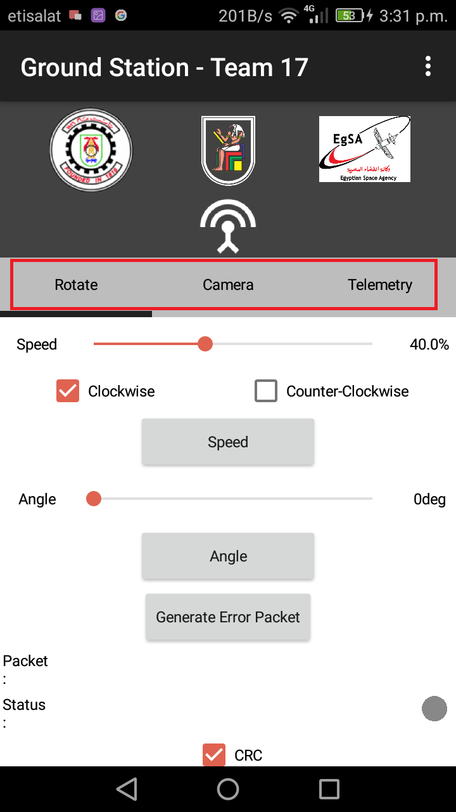
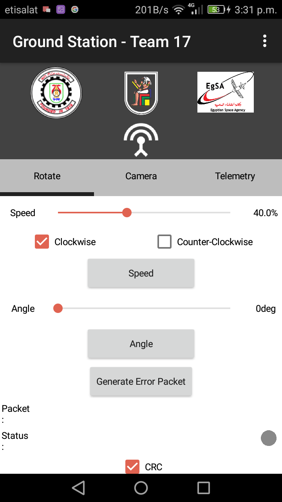
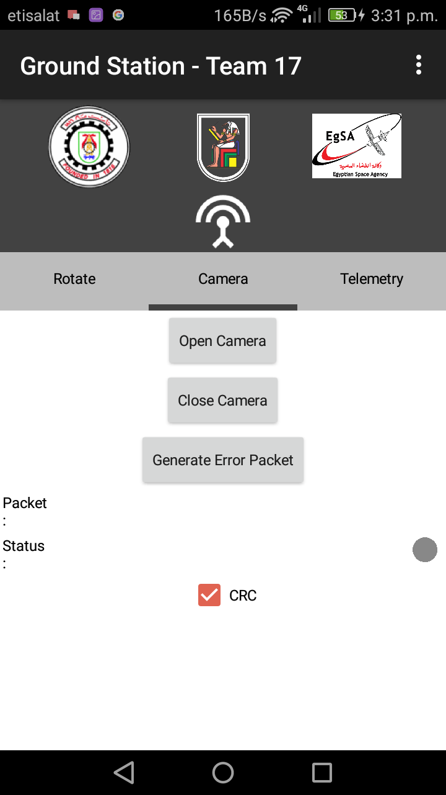
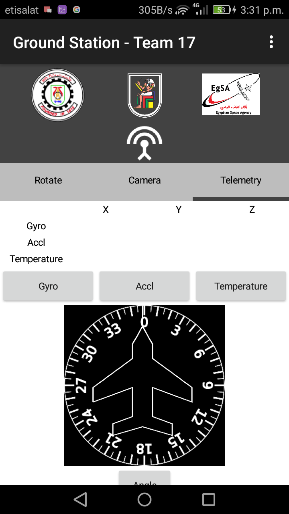

# Ground Station

It is an Android App created by [MIT App Inventor](https://appinventor.mit.edu/), It connects to satellite using Bluetooth, sends commands, recieves data and handle packets. 

It has three tabs:

## 1. Rotate
---

where you can send commands for rotation, using sliders to pick speed of motor, or the required angle you want either clockwise or counter-clockwise. Press the button it will show you packet and status of system.

## 2. Camera

where you can send commands for camera, camera on or off, it also shows you the packet and status of sending.

## 3. Telemetry

Where you can ask satellite to send data like: acceleration (in x, y and z), angular velocity (around x, y and z), Temperature and Euler Angles, or you can request all of them.

