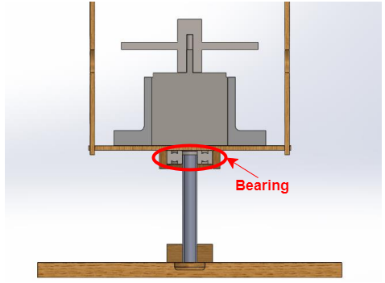
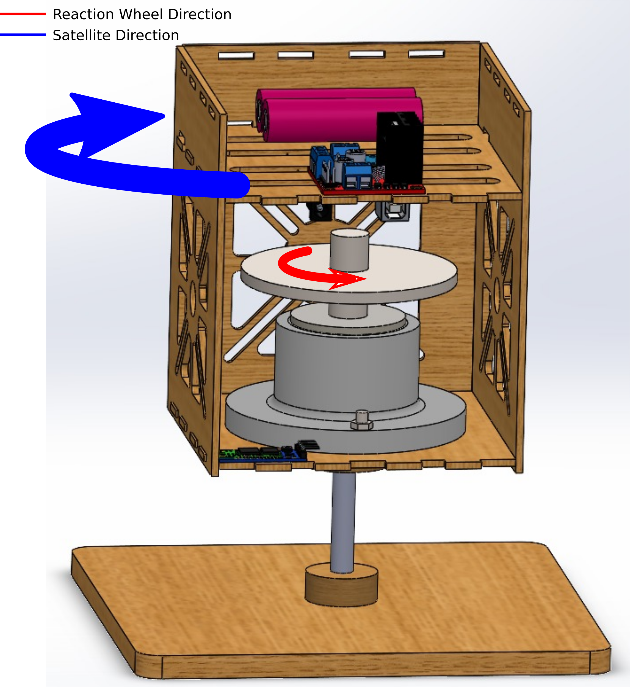
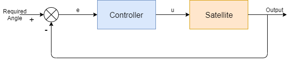

# How it works

Satellite is mounted over a bearing, which allows it to rotate almost freely.

Angle of rotation is controlled by Reaction wheel and due to momentum produced by motor rotating wheel, it produces opposite torque on satellite frame that makes it rotate.

So making wheel rotate in one direction makes the whole satellite rotates in other direction. So there is a relation between motor speed and satellite rotation. 

This relation between speed and rotation can be used to control angle of rotation. 

Adding controller to the system, which outputs the speed of motor, and getting feedback of output which is angle measured by IMU. Calculating error from desired angle and give it to controller which calculates motor speed.