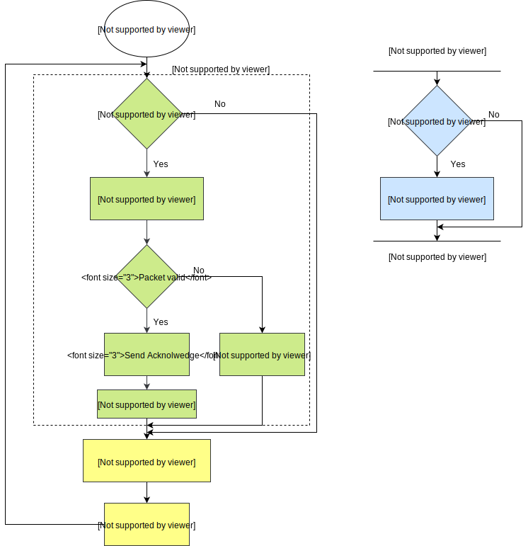
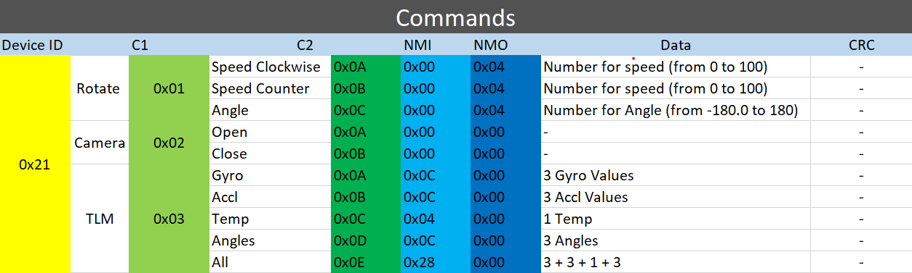

# Components

1. Arduino Mega: processing unit that handels sensor reading, control motor, recieve and send data and executes control logic.
   

2. MPU6050: Inertial measurement unit (IMU), used to determine attitude of the system (the angle). Using [external](https://github.com/jrowberg/i2cdevlib.git) library for attitude determination which uses special chip at MPU6050 board called DMP (Digital Motion Processor).

3. HC-05: Bluetooth module used as transceiver, sends data from satellite to Ground station and recieves commands from ground station.

4. Motor Driver: Controls speed of reaction wheel.

5. An LED: which acts as payload camera, that recieves a signal from ground station which tells camera to take pictures.

# System Connections

Here, you can see all components of systems are connected together.

# Block diagram

Here is the block diagram for the [code](../Source/Code/Code.ino).

# Packets

Data are sent and received in packets, which organizes data and provides error checking. Each packet consists of 7 parts.

|  Part Name   | Description                                                                                  |
| :----------: | -------------------------------------------------------------------------------------------- |
| **DeviceID** | Constant ID for ADCS system (0x21)                                                           |
|    **C1**    | An ID for each command required                                                              |
|    **C2**    | An ID for each subcommand required                                                           |
|   **NMI**    | Number of bytes send from satellite to ground station                                        |
|   **NMO**    | Number of bytes send from ground station to satellite                                        |
|   **Data**   | The data sent or recieved                                                                    |
|   **CRC**    | Cyclic Redundency Chcek bit which is a value calculated for packet to check if error happens |

Here is all available packets.

