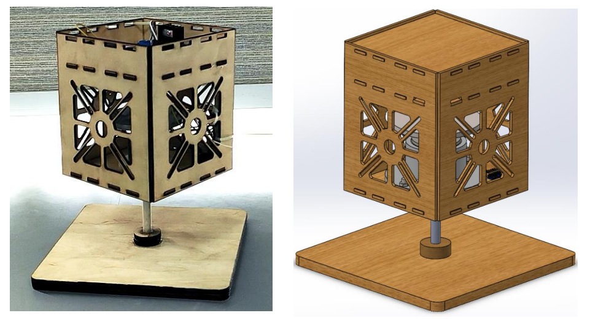
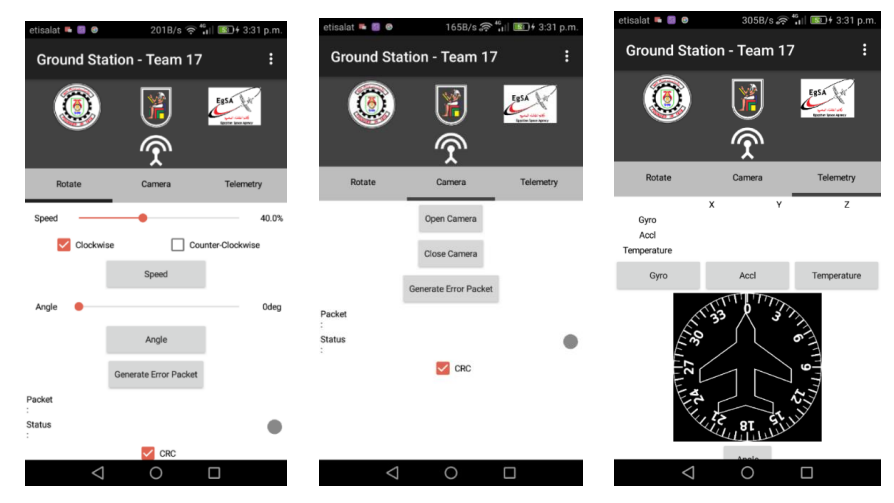

# Attitude Determination and Control Subsystem (ADCS)

This is a simple project to demonstrate satellite ADCS. This is a 1DOF (one degree of freedom) prototype.

It takes input from Ground Station (Android App) which is the required angle, then using both IMU and reaction wheel to drive system to the desired angle. Ground station also offers other features.

# Tools 

For satellite hardware, It uses Arduino Mega, with MPU6050 (Inertial Measurement Unit), HC-05 (Bluetooth module) and Motor Driver powered by Lithium Ion batteries.